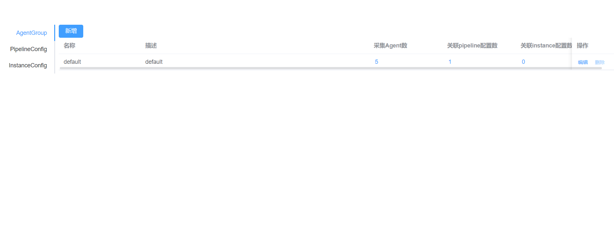

# 部署说明

本项目实现了config-server的后端（config-server）与前端（config-server-ui），并基于docker与docker-compose的方式进行部署

## 快速开始

在启动容器前，用户需先按照[README.md](../backend/README.md)进行数据库的配置。进入`deployment`目录，运行`deployment-compose.yml`，启动三个容器（`mysql`、`config-server`、`config-server-ui`）

```shell
docker compose -f docker-compose.yml up -d
```

启动成功后，通过`http://{your-ip}:8080`即可实现前端页面的访问



## Agent启动

为了便于使用`config-server-ui`，本项目提供了基于docker启动Agent的脚本，复制`deployment`目录下的`Dockefile-agent`到agent的目录下，
修改`.env`中的`${AGENT}`为agent所在目录路径，再次运行下面的命令，这将会启动3个ilogtail agent。

```shell
docker compose -f docker-compose.yml up -d
```

