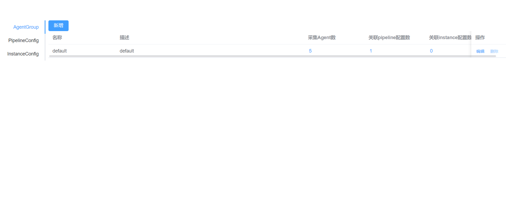

# Config-server-ui
这是基于阿里巴巴 iLogtail 项目 Config Server v2通信协议的一个前端实现。
使用 Vue + Element plus 组件库 + Vue cli 脚手架工具进行开发，
旨在为用户提供一个简单、实用、易嵌入的 Config Server 前端控制台。
后端（Config Server）见[service](../service/README.md)。
## 快速开始

打开`.env`文件，修改`${CONFIG_SERVER}`为后端可访问的URL（如http://127.0.0.1:9090，具体见[service](../service/README.md)），运行下面命令

```shell
npm install
npm run serve
```

启动成功后，通过`http://{your-ip}:8080`即可实现前端页面的访问



本项目同样支持docker方式启动应用，Dockerfile见`Dockerfile`（不建议使用，通过docker-compose一键部署脚本，可以更快实现应用搭建，参考[deployment](../deployment/README.md)。

