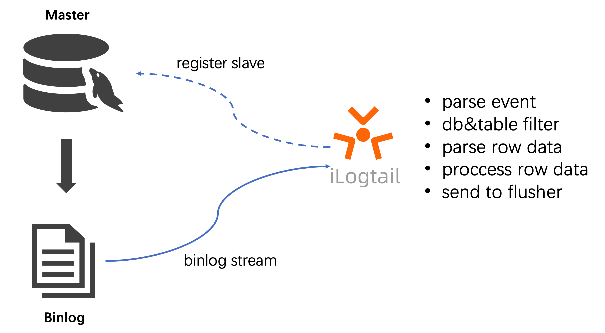

# 使用iLogtail采集MySQL Binlog

`iLogtail`是阿里云日志服务（SLS）团队自研的可观测数据采集`Agent`，拥有的轻量级、高性能、自动化配置等诸多生产级别特性，可以署于物理机、虚拟机、`Kubernetes`等多种环境中来采集遥测数据。iLogtail在阿里云上服务了数万家客户主机和容器的可观测性采集工作，在阿里巴巴集团的核心产品线，如淘宝、天猫、支付宝、菜鸟、高德地图等也是默认的日志、监控、Trace等多种可观测数据的采集工具。目前iLogtail已有千万级的安装量，每天采集数十PB的可观测数据，广泛应用于线上监控、问题分析/定位、运营分析、安全分析等多种场景，在实战中验证了其强大的性能和稳定性。<br />在当今云原生的时代，我们坚信开源才是iLogtail最优的发展策略，也是释放其最大价值的方法。因此，我们决定将`iLogtail`开源，期望同众多开发者一起将iLogtail打造成世界一流的可观测数据采集器。

## MySQL Binlog背景

MySQL Binlog记录了MySQL的变更日志，包括DML、DDL等，其中DML不会记录SELECT、SHOW等，因为只读的SQL语句不会对数据库的状态产生影响。<br />Binlog对于MySQL的重要性不言而喻，在数据库崩溃的情况下可以借助Binlog进行恢复。因为Binlog记录了每个变更的内容，所以理论上可以将数据库的状态恢复到Binlog存在的任意时刻，常用数据库备份。<br />主从复制也是Binlog的一个重要使用场景，在读多写少的互联网应用中，数据库一主多从的部署架构可以给应用增加更多的响应能力，从库从主库同步数据往往也会借助Binlog。<br />数据库操作审计，由于Binlog记录了所有对数据库的更改操作，所以一些误操作或者危险操作也会记录其中，将Binlog记录下来，分析其中的操作行为，可以实现轻量级的数据库操作审计，追踪其中的误操作发生的时间或者识别危险SQL的发生。

Binlog如此重要，业界也有一些方案来同步Binlog的数据，如Canal、MaxWell、DTS等。不同的工具可以实现不同的目标，iLogtail也提供了便捷的Binlog同步功能，iLogtail采集到Binlog后，可以将结果输出到各类flusher，本文以采集到Kafka为例进行介绍。

## 理解iLogtail采集Binlog原理

iLogtail内部实现了MySQL Slave节点的交互协议，具体流程如下所示。

1. iLogtail模拟MySQL Slave节点向MySQL master节点发送dump请求。
1. MySQL master节点收到dump请求后，会将自身的Binlog实时发送给iLogtail。
1. iLogtail对Binlog进行事件解析、过滤、数据解析等操作，并将解析好的数据上传到Flusher。



### 支持Binlog位点

通过指定Binlog的位置，支持从Binlog特定位点进行消费。

### 支持Checkpoint

在iLogtail重启或者机器意外重启的情况下，iLogtail会对当前消费的位点进行保存，并在下次重新启动时，从上次消费的位置进行消费。

### 支持多种数据库过滤

支持对数据库的表进行黑白名单配置。

### 支持全局事务ID（GTID）

支持MySQL数据库服务器的GTID功能，避免主从切换引起的数据丢失。

## 使用场景

本文介绍使用iLogtail对数据库的增删改的Binlog进行采集，并且将采集到的数据输出到Kafka。本文以MySQL的示例数据库`employees`为例进行采集。其中涉及的表为`titles`。内容如下

| emp_no | title|from_date|to_date |
| ---- | ---- | ---- | ---- |
| 10006| Senior Engineer | 1990-08-05 | 9999-01-01 |

## 部署iLogtail采集MySQL Binlog

接下来介绍如果使用iLogtail采集MySQL的Binlog

### 前提条件

- 安装MySQL并且开启Binlog，Binlog为ROW模式；参考[链接](https://dev.mysql.com/doc/refman/8.0/en/replication-options-binary-log.html#sysvar_log_bin)。
- 安装kafka，下载、解压

```bash
wget  https://dlcdn.apache.org/kafka/3.2.0/kafka_2.13-3.2.0.tgz
tar -xzf kafka_2.13-3.2.0.tgz
cd kafka_2.13-3.2.0
```

- 启动kafka

```bash
# Start the ZooKeeper service
# Note: Soon, ZooKeeper will no longer be required by Apache Kafka.
$ nohup bin/zookeeper-server-start.sh config/zookeeper.properties &

# Start the Kafka broker service
$ nohup bin/kafka-server-start.sh config/server.properties &
```

- 创建topic，设置为binlog。

```shell
bin/kafka-topics.sh --create --topic binlog --bootstrap-server localhost:9092
```

- 更多部署说明，详见[链接](https://kafka.apache.org/quickstart)。

### 安装iLogtail

- 下载iLogtail

```shell
$ wget https://ilogtail-community-edition.oss-cn-shanghai.aliyuncs.com/1.1.0/ilogtail-1.1.0.linux-amd64.tar.gz
tar -xzvf ilogtail-1.1.0.linux-amd64.tar.gz
$ cd ilogtail-1.1.0
$ ll
drwxrwxr-x 5 505 505      4096 7月  10 18:00 example_config
-rwxr-xr-x 1 505 505  84242040 7月  11 00:00 ilogtail
-rwxr-xr-x 1 505 505     16400 7月  11 00:00 libPluginAdapter.so
-rw-r--r-- 1 505 505 115963144 7月  11 00:00 libPluginBase.so
-rw-rw-r-- 1 505 505     11356 7月  11 00:00 LICENSE
-rw-rw-r-- 1 505 505      4834 7月  11 00:00 README.md
-rw-rw-r-- 1  505  505    118 7月  14 11:22 ilogtail_config.json
drwxr-xr-x 2 root root    4096 7月  12 09:55 config
```

- 采集配置

在`config/local`目录下创建binlog.yaml

```yaml
enable: true
inputs:
  - Type: service_canal
    Host: 127.0.0.1
    Port: 3306
    ServerID: 123456
    Password: xxxxx
    EnableDDL: true
    TextToString: true
flushers:
  - Type: flusher_kafka
    Brokers:
      - localhost:9092
    Topic: access-log
```

```shell
$ tree config/local/
config/local/
└── binlog.yaml
```

- 启动ilogtail

```shell
nohup ./ilogtail > stdout.log 2> stderr.log &
```

### 验证

终端1: 启动kafka-console-consumer，消费binlog

```shell
bin/kafka-console-consumer.sh --topic binlog --from-beginning --bootstrap-server localhost:9092
```

终端2：分别执行三条语句更新数据库

```sql
# 分别执行三条sql语句
update titles set title = 'test-update' where emp_no = 10006

delete from titles where emp_no = 10006

INSERT INTO `titles` (`emp_no`, `title`, `from_date`, `to_date`)
VALUES
 (10006, 'Senior Engineer', '1990-08-05', '9999-01-01');
```

终端1：查看结果

```shell
## 终端1: 消费到写入的访问日志，说明流程正常。

{"Time":1657890330,"Contents":[{"Key":"_table_","Value":"titles"},{"Key":"_offset_","Value":"4308"},{"Key":"_old_emp_no","Value":"10006"},{"Key":"from_date","Value":"1990-08-05"},{"Key":"_host_","Value":"127.0.0.1"},{"Key":"_event_","Value":"row_update"},{"Key":"_id_","Value":"12"},{"Key":"_old_from_date","Value":"1990-08-05"},{"Key":"_gtid_","Value":"00000000-0000-0000-0000-000000000000:0"},{"Key":"_db_","Value":"employees"},{"Key":"_filename_","Value":"mysql-bin.000001"},{"Key":"_old_title","Value":"Senior Engineer"},{"Key":"_old_to_date","Value":"9999-01-01"},{"Key":"emp_no","Value":"10006"},{"Key":"title","Value":"test-update"},{"Key":"to_date","Value":"9999-01-01"}]}

{"Time":1657890333,"Contents":[{"Key":"_id_","Value":"13"},{"Key":"_filename_","Value":"mysql-bin.000001"},{"Key":"emp_no","Value":"10006"},{"Key":"title","Value":"test-update"},{"Key":"_db_","Value":"employees"},{"Key":"_table_","Value":"titles"},{"Key":"_event_","Value":"row_delete"},{"Key":"from_date","Value":"1990-08-05"},{"Key":"to_date","Value":"9999-01-01"},{"Key":"_host_","Value":"127.0.0.1"},{"Key":"_gtid_","Value":"00000000-0000-0000-0000-000000000000:0"},{"Key":"_offset_","Value":"4660"}]}

{"Time":1657890335,"Contents":[{"Key":"_offset_","Value":"4975"},{"Key":"emp_no","Value":"10006"},{"Key":"title","Value":"Senior Engineer"},{"Key":"from_date","Value":"1990-08-05"},{"Key":"_gtid_","Value":"00000000-0000-0000-0000-000000000000:0"},{"Key":"_filename_","Value":"mysql-bin.000001"},{"Key":"_table_","Value":"titles"},{"Key":"_event_","Value":"row_insert"},{"Key":"_id_","Value":"14"},{"Key":"to_date","Value":"9999-01-01"},{"Key":"_host_","Value":"127.0.0.1"},{"Key":"_db_","Value":"employees"}]}

```

## 总结

通过以上的示例，演示了如何使用iLogtail采集MySQL的Binlog日志。借助iLogtail进行简单的配置，即可完成对Binlog的采集，同时iLogtail也支持更多的灵活的配置，对采集的格式进行配置，iLogtail基于Canal的方案来对数据库进行采集。<br />通过采集Binlog可以在SLS对数据库的增量改动进行查询、分析、可视化；也可以借助SLS的告警功能对于危险SQL进行监控告警配置，在SLS可以进行低成本长期存储，高性能查询来实现审计的需求。

## 关于iLogtail

iLogtail作为阿里云SLS提供的可观测数据采集器，可以运行在服务器、容器、K8s、嵌入式等多种环境，支持采集数百种可观测数据（日志、监控、Trace、事件等），已经有千万级的安装量。目前，iLogtail已正式开源，欢迎使用及参与共建。

- GitHub：[https://github.com/alibaba/ilogtail](https://github.com/alibaba/ilogtail)
- 社区版文档：[https://ilogtail.gitbook.io/ilogtail-docs/about/readme](https://ilogtail.gitbook.io/ilogtail-docs/about/readme)
- 交流群请扫描


