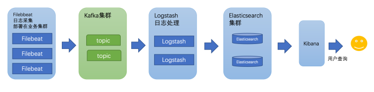
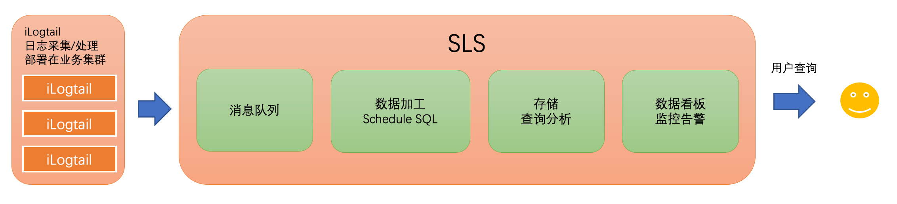
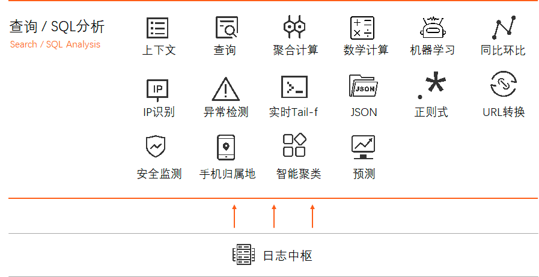
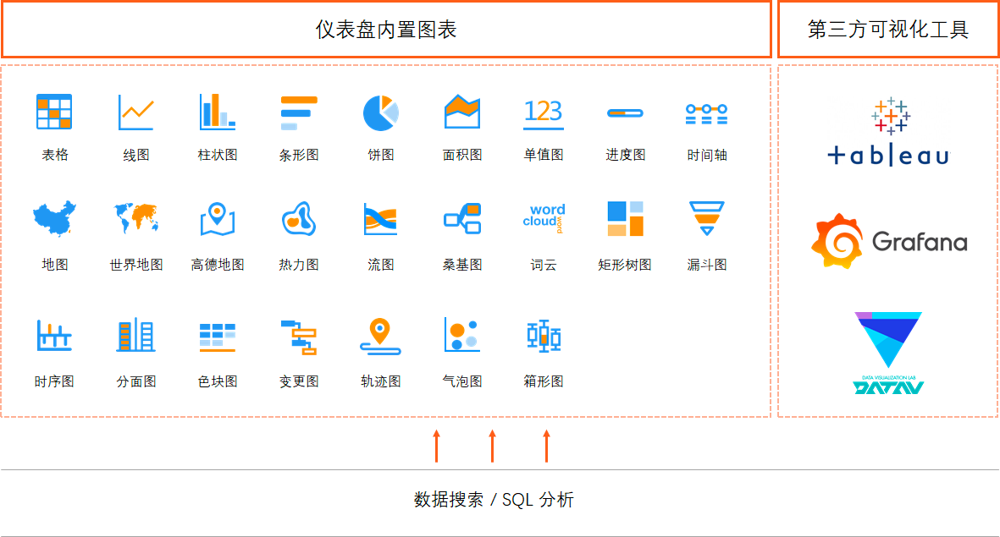
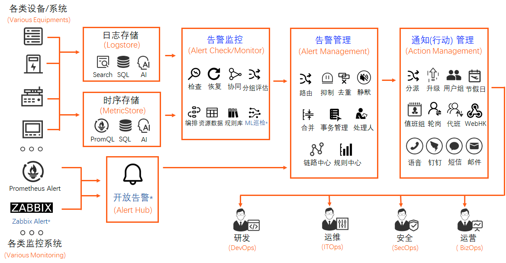
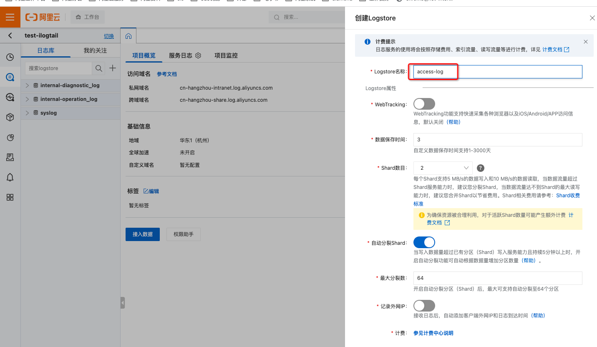
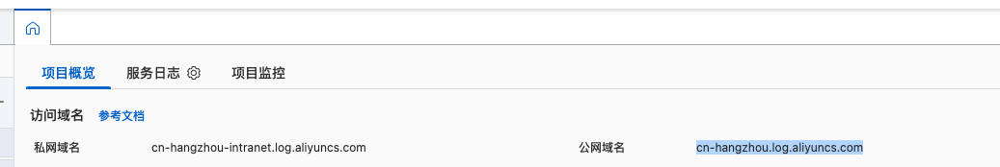
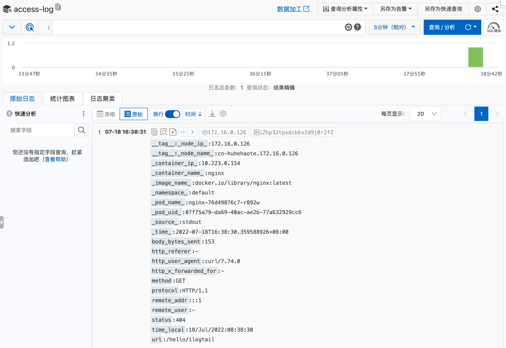

# K8s环境采集业务日志到SLS

`iLogtail`是阿里云日志服务（SLS）团队自研的可观测数据采集`Agent`，拥有的轻量级、高性能、自动化配置等诸多生产级别特性，可以署于物理机、虚拟机、`Kubernetes`等多种环境中来采集遥测数据。iLogtail在阿里云上服务了数万家客户主机和容器的可观测性采集工作，在阿里巴巴集团的核心产品线，如淘宝、天猫、支付宝、菜鸟、高德地图等也是默认的日志、监控、Trace等多种可观测数据的采集工具。目前iLogtail已有千万级的安装量，每天采集数十PB的可观测数据，广泛应用于线上监控、问题分析/定位、运营分析、安全分析等多种场景，在实战中验证了其强大的性能和稳定性。 在当今云原生的时代，我们坚信开源才是iLogtail最优的发展策略，也是释放其最大价值的方法。因此，我们决定将`iLogtail`开源，期望同众多开发者一起将iLogtail打造成世界一流的可观测数据采集器。

## 背景

日志作为可观测性建设中的重要一环，可以记录详细的访问请求以及错误信息，在业务分析、问题定位等方面往往会发挥很大的作用。一般开发场景下，当需要进行日志分析时，往往是直接在日志文件中进行grep搜索对应的关键字；但在大规模分布式生产环境下，此方法效率低下，常见解决思路是建立集中式日志收集系统，将所有节点上的日志统一收集、管理、分析。目前市面上比较主流的开源方案是基于ELK构建一套日志采集分析系统。



该架构中，`Filebeat`作为日志源的采集`Agent`部署在业务集群上进行原始日志采集，并采集到的日志发送到消息队列`Kafka`集群。之后，由`Logstash`从`Kafka`消费数据，并经过过滤、处理后，将标准化后的日志写入`Elasticsearch`集群进行存储。最后，由`Kibana`呈现给用户查询。虽然该架构可以提供比较完整的日志采集、分析功能，但是整体涉及的组件非常多，大规模生产环境部署复杂度高，且大流量下ES可能不稳定，运维成本都会很高。

阿里云提供的SLS服务是一个纯定位在日志/时序类可观测数据分析场景的云上托管服务，相对于ELK在日志领域内做了很多定制化开发，在易用性、功能完备性、性能、成本等方便，都有不错表现。`iLogtail`作为SLS官方标配的可观测数据采集器，在[日志采集性能](https://github.com/alibaba/ilogtail/blob/main/docs/zh/performance/Performance-compare-with-filebeat.md)及[K8s](https://developer.aliyun.com/article/806369)支持上都有不错的体验；`iLogtail`有明显的性能优势，可以将部分数据处理前置，有效降低存储成本。



目前**社区版**`iLogtail`也对SLS提供了很好的支持，本文将会详细介绍如何使用**社区版**`iLogtail`，并结合SLS云服务快速构建出一套高可用、高性能的日志采集分析系统。

备注：`iLogtail`**社区版**相对于`iLogtail`企业版，核心采集能力上基本是一致的，但是管控、可观测能力上会有所弱化，这些能力需要配合SLS服务端才能发挥出来。欢迎使用[iLogtail企业版](https://help.aliyun.com/document\_detail/95923.html)体验，两个版本差异详见[链接](https://ilogtail.gitbook.io/ilogtail-docs/about/compare-editions)。

## SLS简介

日志服务SLS是云原生观测与分析平台，为Log、Metric、Trace等数据提供大规模、低成本、实时的平台化服务。日志服务一站式提供数据采集、加工、查询与分析、可视化、告警、消费与投递等功能，全面提升您在研发、运维、运营、安全等场景的数字化能力。 通过SLS可以快速的搭建属于自己的可观测分析平台，可以快速享受到SLS提供的各种数据服务，包括不限于：查询与分析、可视化、告警等。

* 查询分析
  * 支持精确查询、模糊查询、全文查询、字段查询。
  * 以SQL作为查询和分析框架，同时在框架中融入PromQL语法和机器学习函数。



* 可视化
  * 基于SLS统一的查询分析引擎，以图表的形式将查询与分析结果呈现出来，清晰呈现全局态势。
  * 支持与第三方可视化工具对接。



* 监控告警：提供一站式的告警监控、降噪、事务管理、通知分派的智能运维平台。



## 操作实战

以下介绍如何使用`iLogtail`社区版采集K8s环境业务日志到SLS。

### 场景 <a href="#reuza" id="reuza"></a>

选择Label为`app: nginx`的容器，采集标准输出流`stdout`（访问日志）、标准错误流`stderr`（错误日志），并将采集到的日志写入SLS中。采集`json.log`文本日志写入SLS。

其中，`stdout`使用正则解析将日志解析为结构化日志；`stdin`为单行文本打印；`json.log`为JSON格式文件。

如果之前已经使用`iLogtail`将日志采集到`Kafka`，在迁移阶段可以保持双写，等稳定后删除`Kafka Flusher`配置即可。


### 前提条件

* 登陆阿里云SLS控制台，[开通SLS服务](https://help.aliyun.com/document\_detail/54604.html#section-j4p-xt3-arc)。
* 已创建一个Project；两个logstore，分别为access-log、error-log。更多信息，请参见[创建Project](https://help.aliyun.com/document\_detail/48984.htm#section-ahq-ggx-ndb)和[创建Logstore](https://help.aliyun.com/document\_detail/48990.htm#section-v52-2jx-ndb)。



* 开启[全文索引](https://help.aliyun.com/document\_detail/90732.html)。
* 进入Project首页，查看[访问域名](https://help.aliyun.com/document\_detail/29008.html?spm=5176.2020520112.help.dexternal.5d8b34c0QXLYgp)。



* K8s环境已部署nginx。

```yaml  {.line-numbers}
apiVersion: apps/v1
kind: Deployment
metadata:
  name: nginx
  namespace: default
  labels:
    app: nginx
spec:
  replicas: 1
  selector:
    matchLabels:
      app: nginx
  template:
    metadata:
      labels:
        app: nginx
    spec:
      containers:
        - image: 'nginx:latest'
          name: nginx
          ports:
            - containerPort: 80
              name: http
              protocol: TCP
          resources:
            requests:
              cpu: 100m
              memory: 100Mi
```

* K8s环境已部署打印json日志文件的程序。

```yaml {.line-numbers}
apiVersion: apps/v1
kind: Deployment
metadata:
  labels:
    app: json-log
  name: json-log
  namespace: default
spec:
  replicas: 1
  selector:
    matchLabels:
      app: json-log
  template:
    metadata:
      labels:
        app: json-log
    spec:
      containers:
        - args:
            - >-
              mkdir -p /root/log; while true; do date +'{"time":"+%Y-%m-%d
              %H:%M:%S","message":"Hello, iLogtail!"}' >>/root/log/json.log;
              sleep 10; done
          command:
            - /bin/sh
            - '-c'
            - '--'
          image: 'alpine:3.9.6'
          name: json-log
          volumeMounts:
            - mountPath: /etc/localtime
              name: volume-localtime
      volumes:
        - hostPath:
            path: /etc/localtime
            type: ''
          name: volume-localtime
```

### 部署iLogtail <a href="#vmyyq" id="vmyyq"></a>

本章节所使用的配置可在[GitHub](https://github.com/alibaba/ilogtail/blob/main/k8s\_templates/ilogtail-daemonset-sls.yaml)下载，容器标准输出插件详细配置可移步[iLogtail用户手册](https://ilogtail.gitbook.io/ilogtail-docs/plugins/input/input-docker-stdout)。

* 创建命名空间

推荐将iLogtail部署在独立的命名空间站以便管理。

ilogtail-ns.yaml

```yaml
apiVersion: v1
kind: Namespace
metadata:
  name: ilogtail
```

```bash
kubectl apply -f ilogtail-ns.yaml
```

* 创建采集配置

ilogtail-user-configmap.yaml

```yaml {.line-numbers}
apiVersion: v1
kind: ConfigMap
metadata:
  name: ilogtail-user-cm
  namespace: ilogtail
data:
  nginx_stdout.yaml: |
    enable: true
    inputs:
      - Type: service_docker_stdout
        Stderr: false
        Stdout: true
        IncludeK8sLabel:
          app: nginx
    processors:
      - Type: processor_regex
        SourceKey: content
        Regex: '([\d\.:]+) - (\S+) \[(\S+) \S+\] \"(\S+) (\S+) ([^\\"]+)\" (\d+) (\d+) \"([^\\"]*)\" \"([^\\"]*)\" \"([^\\"]*)\"'
        Keys:
          - remote_addr
          - remote_user
          - time_local
          - method
          - url
          - protocol
          - status
          - body_bytes_sent
          - http_referer
          - http_user_agent
          - http_x_forwarded_for
    flushers:
      - Type: flusher_sls
        Region: cn-hangzhou
        Endpoint: cn-hangzhou.log.aliyuncs.com
        Project: test-ilogtail
        Logstore: access-log
      - Type: flusher_kafka
        Brokers:
          - localhost:9092
        Topic: access-log
  nginx_stderr.yaml: |
    enable: true
    inputs:
      - Type: service_docker_stdout
        Stderr: true
        Stdout: false
        K8sNamespaceRegex: "^(default)$"
        K8sPodRegex: "^(nginx-.*)$"
        K8sContainerRegex: "nginx"
    flushers:
      - Type: flusher_sls
        Region: cn-hangzhou
        Endpoint: cn-hangzhou.log.aliyuncs.com
        Project: test-ilogtail
        Logstore: error-log
      - Type: flusher_kafka
        Brokers:
          - localhost:9092
        Topic: error-log
  json_log.yaml: |
    enable: true
    inputs:
      - Type: input_file
        FilePaths: 
          - /root/log/json.log
        EnableContainerDiscovery: true
        ContainerFilters:
          IncludeContainerLabel:
            io.kubernetes.container.name: json-log
    processors:
      - Type: processor_json
        SourceKey: content
        KeepSource: false
        ExpandDepth: 1
        ExpandConnector: ""
    flushers:
      - Type: flusher_sls
        Region: cn-hangzhou
        Endpoint: cn-hangzhou.log.aliyuncs.com
        Project: test-ilogtail
        Logstore: json-log
      - Type: flusher_kafka
        Brokers:
          - localhost:9092
        Topic: json-log
```

将模版中的33-35、51-53、75-77行修改为实际SLS目标存储库，38、56、80行修改为实际Kafka broker地址。

```bash
kubectl apply -f ilogtail-user-configmap.yaml
```

这里的ConfigMap期望以文件夹的方式挂载到iLogtail容器中作为采集配置目录，因此可以包含多个iLogtail采集配置文件，第7-39行为一个采集配置，40-57为另一个采集配置，分别将nginx的标准输出流和标准错误流采集到`SLS`不同的`logstore` 及`Kafka`不同的`Topic`中。双写适用于从`Kafka`迁移到SLS的场景，如果迁移完成稳定后，可以删除`flusher_kafka`，只保留`flusher_sls`即可。

第13-14和46-48行展示了如何为日志采集筛选容器，前者使用Kubernetes Label作为筛选条件，后者则使用了Namespace、Pod和Container名称作筛选，所有支持的配置项可以参考iLogtail用户手册中的[容器标准输出](https://ilogtail.gitbook.io/ilogtail-docs/plugins/input/input-docker-stdout)。

第16-30行展示了如何使用插件对日志进行正则解析，配置项含义可以参考iLogtail用户手册中的[正则](https://ilogtail.gitbook.io/ilogtail-docs/plugins/processor/regex)。

* 获取阿里云AK，并创建密钥

ilogtail-secret.yaml

```yaml {.line-numbers}
apiVersion: v1
kind: Secret
metadata:
  name: ilogtail-secret
  namespace: ilogtail
type: Opaque
data:
  access_key_id: <base64_access_key_id>
  access_key: <base64_access_key_secret>
```

获取阿里云AK，进行base64。

```bash
echo -n '<aliyun_access_key_secret>' | base64
echo -n '<aliyun_access_key_id>' | base64
```

在模版中修改8-9行。

```bash
kubectl apply -f ilogtail-secret.yaml
```

* 部署iLogtail DaemonSet

ilogtail-deployment.yaml

```yaml {.line-numbers}
apiVersion: apps/v1
kind: DaemonSet
metadata:
  name: ilogtail-ds
  namespace: ilogtail
  labels:
    k8s-app: logtail-ds
spec:
  selector:
    matchLabels:
      k8s-app: logtail-ds
  template:
    metadata:
      labels:
        k8s-app: logtail-ds
    spec:
      tolerations:
      - key: node-role.kubernetes.io/master
        effect: NoSchedule
      containers:
      - name: logtail
        env:
          - name: ALIYUN_LOG_ENV_TAGS # add log tags from env
            value: _node_name_|_node_ip_
          - name: _node_name_
            valueFrom:
              fieldRef:
                apiVersion: v1
                fieldPath: spec.nodeName
          - name: _node_ip_
            valueFrom:
              fieldRef:
                apiVersion: v1
                fieldPath: status.hostIP
          - name: cpu_usage_limit
            value: "1"
          - name: mem_usage_limit
            value: "512"
          - name: default_access_key_id
            valueFrom:
              secretKeyRef:
                name: ilogtail-secret
                key: access_key_id
                optional: true
          - name: default_access_key
            valueFrom:
              secretKeyRef:
                name: ilogtail-secret
                key: access_key
                optional: true
        image: >-
          sls-opensource-registry.cn-shanghai.cr.aliyuncs.com/ilogtail-community-edition/ilogtail:latest
        imagePullPolicy: IfNotPresent
        resources:
          limits:
            cpu: 1000m
            memory: 1Gi
          requests:
            cpu: 400m
            memory: 384Mi
        volumeMounts:
          - mountPath: /var/run
            name: run
          - mountPath: /logtail_host
            mountPropagation: HostToContainer
            name: root
            readOnly: true
          - mountPath: /usr/local/ilogtail/checkpoint
            name: checkpoint
          - mountPath: /usr/local/ilogtail/config/local
            name: user-config
            readOnly: true
      dnsPolicy: ClusterFirstWithHostNet
      hostNetwork: true
      volumes:
        - hostPath:
            path: /var/run
            type: Directory
          name: run
        - hostPath:
            path: /
            type: Directory
          name: root
        - hostPath:
            path: /var/lib/ilogtail-ilogtail-ds/checkpoint
            type: DirectoryOrCreate
          name: checkpoint
        - configMap:
            defaultMode: 420
            name: ilogtail-user-cm
          name: user-config
```

```bash
kubectl apply -f ilogtail-deployment.yaml
```

配置文件的17-19行定义了部署节点的容忍性：不在master节点部署。

23-34行通过环境变量额外采集了iLogtail容器所在节点的ip和name（这两个值对于业务容器和iLogtail必然相同）。

35-38行通过容器环境变量对iLogtail进行了系统配置，这里配置了cpu和memory上限。完整的系统配置说明可以参考iLogtail用户手册中的[系统参数](https://ilogtail.gitbook.io/ilogtail-docs/configuration/system-config)。

43-48行定义了采集Agent容器允许使用的资源范围。若需要采集的日志文件数量很多，则需要适当地放宽资源限制。

39-50行引用了secret中的AK作为环境变量，这对于将日志写入到SLS是必须的。

配置文件的62-72行挂载了一些目录，说明如下：

`/var/run`：iLogtail与容器运行时通信的socket

`/logtail_host`：iLogtail通过挂载主机目录获取节点上所有容器的日志

`/usr/local/ilogtail/checkpoint`：将状态持久化到主机磁盘，iLogtail容器重启不丢失

`/usr/local/ilogtail/config/local`：将configmap中的配置挂载到容器中

### 验证 <a href="#fr6wn" id="fr6wn"></a>

* 访问日志验证，查看logstore数据正常。

给nginx发送几条测试请求，如：

```bash
# 写入访问日志
kubectl exec nginx-76d49876c7-r892w -- curl localhost/hello/ilogtail
```

SLS控制台查询结果



* 错误日志验证，查看logstore数据正常。

SLS控制台查询结果


* JSON日志验证，查看logstore数据正常

SLS控制台查询结果


## 总结 <a href="#ovoc3" id="ovoc3"></a>

以上，我们介绍了使用iLogtail社区版将K8s业务日志采集到SLS的方法。如果想体验企业版iLogtail与SLS更深度的集成能力，欢迎使用iLogtail企业版，并配合SLS构建可观测平台。

## 关于iLogtail

iLogtail作为阿里云SLS提供的可观测数据采集器，可以运行在服务器、容器、K8s、嵌入式等多种环境，支持采集数百种可观测数据（日志、监控、Trace、事件等），已经有千万级的安装量。目前，iLogtail已正式开源，欢迎使用及参与共建。

* GitHub：[https://github.com/alibaba/ilogtail](https://github.com/alibaba/ilogtail)
* 社区版文档：[https://ilogtail.gitbook.io/ilogtail-docs/about/readme](https://ilogtail.gitbook.io/ilogtail-docs/about/readme)
* 交流群请扫描


