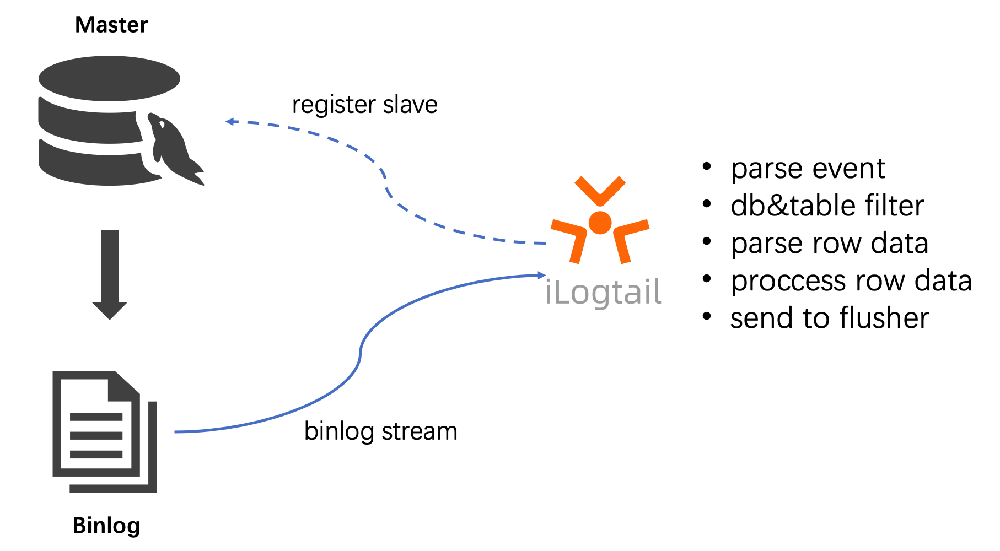
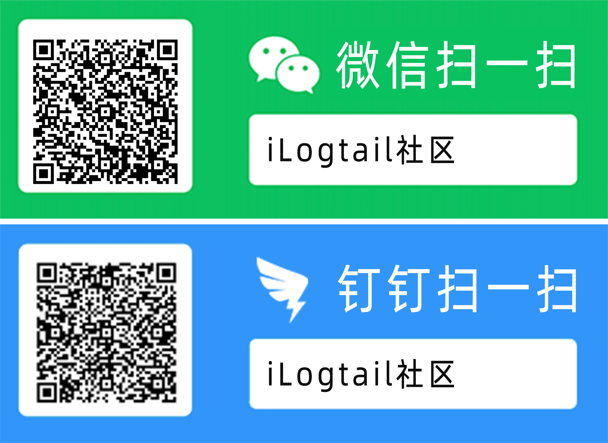

# Use iLogtail to collect MySQL Binlog

'iLogtail' is a observable data collection 'Agent' developed by the Alibaba Cloud log service (SLS) team. It has many production-level features such as lightweight, high-performance, and automated configuration. It can be used to collect telemetry data in various environments such as physical machines, virtual machines, and 'Kubernetes.iLogtail has served the observability collection of tens of thousands of customer hosts and containers on Alibaba Cloud. Its core product lines, such as Taobao, Tmall, Alipay, Cainiao, and AMAP, are also default tools for collecting various observable data such as logs, monitoring, and Trace. Currently, iLogtail has tens of millions of installation capacity,Dozens of PB of observable data are collected every day, which are widely used in various scenarios such as online monitoring, problem analysis/positioning, Operation analysis, and security analysis, and have verified its strong performance and stability in actual combat. <br /> in today's cloud-native era, we firmly believe that open source is the best development strategy for iLogtail,It is also a way to release its maximum value. Therefore, we decided to open the 'iLogtail' source, hoping to work with many developers to build iLogtail into a world-class observable data collector.

## What is MySQL Binlog

MySQL Binlog records MySQL change logs, including DML and DDL. DML does not record SELECT and SHOW, because Read-Only SQL statements do not affect the status of the database. <br /> The importance of Binlog to MySQL is self-evident,In the event of a database crash, Binlog can be used for recovery. Because Binlog records the content of each change, the database status can be restored to any time when Binlog exists. Database backup is often used. <br /> master-slave replication is also an important scenario for Binlog,In Internet applications with more reading and less writing, the deployment architecture of a database with more master and more slave can increase the response capability of the application. The Slave Database often synchronizes data from the master database with the help of Binlog. <br /> database operation audit. Binlog records all changes to the database, so some misoperations or dangerous operations are also recorded,By recording Binlog and analyzing the Operation behavior, you can implement lightweight database operation audit, track the occurrence time of misoperations or identify the occurrence of dangerous SQL statements.

Binlog is so important that there are also some solutions in the industry to synchronize Binlog data, such as Canal, MaxWell, and DTS. Different tools can achieve different goals. iLogtail also provides a convenient Binlog synchronization function. After iLogtail Binlog is collected,You can output the results to various flusher. This topic describes how to collect the results from Kafka.

## Understand the principle of iLogtail Binlog collection

The interaction protocol between iLogtail nodes is implemented in the MySQL Slave. The specific process is as follows.

1. iLogtail the simulated MySQL Slave node to send a dump request to the MySQL master node.
1. After receiving the dump request, MySQL master node sends its own Binlog to the iLogtail in real time.
1. iLogtail perform event parsing, filtering, and data parsing operations on binlogs, and upload the parsed data to the Flusher.



### Binlog offset supported

You can specify the Binlog location to consume data from a specific Binlog location.

### 支持Checkpoint

When the iLogtail restarts or the machine restarts unexpectedly, the iLogtail saves the current consumption point and consumes it from the last consumption point on the next restart.

### Supports multiple database filtering

You can configure a blacklist or whitelist for tables in a database.

### Global transaction ID(GTID) is supported

Supports GTID for MySQL database servers to avoid data loss caused by master-slave switchover.

## Scenario

This topic describes how to use iLogtail to collect binlogs that are added, deleted, and modified in a database and output the collected data to Kafka. This topic uses the MySQL sample database 'employees' as an example to collect data. The table involved is 'titles '. Read as follows

| emp_no | title|from_date|to_date |
| ---- | ---- | ---- | ---- |
| 10006| Senior Engineer | 1990-08-05 | 9999-01-01 |

## Deploy iLogtail collection MySQL Binlog

Next, if you use iLogtail to collect MySQL binlogs

### Prerequisites

- Install MySQL and enable Binlog. Binlog is in ROW MODE. For more information, see [link](https://dev.mysql.com/doc/refman/8.0/en/replication-options-binary-log.html#sysvar_log_bin)。
- Install kafka, download and decompress it

```bash
wget  https://dlcdn.apache.org/kafka/3.2.0/kafka_2.13-3.2.0.tgz
tar -xzf kafka_2.13-3.2.0.tgz
cd kafka_2.13-3.2.0
```

- Start kafka

```bash
# Start the ZooKeeper service
# Note: Soon, ZooKeeper will no longer be required by Apache Kafka.
$ nohup bin/zookeeper-server-start.sh config/zookeeper.properties &

# Start the Kafka broker service
$ nohup bin/kafka-server-start.sh config/server.properties &
```

- Create a topic and set it to binlog.

```shell
bin/kafka-topics.sh --create --topic binlog --bootstrap-server localhost:9092
```

- For more deployment instructions, see [link](https://kafka.apache.org/quickstart).

### Install iLogtail

- Download iLogtail

```shell
$ wget https://ilogtail-community-edition.oss-cn-shanghai.aliyuncs.com/1.1.0/ilogtail-1.1.0.linux-amd64.tar.gz
tar -xzvf ilogtail-1.1.0.linux-amd64.tar.gz
$ cd ilogtail-1.1.0
$ ll
drwxrwxr-x 5 505 505      4096 7月  10 18:00 example_config
-rwxr-xr-x 1 505 505  84242040 7月  11 00:00 ilogtail
-rwxr-xr-x 1 505 505     16400 7月  11 00:00 libPluginAdapter.so
-rw-r--r-- 1 505 505 115963144 7月  11 00:00 libPluginBase.so
-rw-rw-r-- 1 505 505     11356 7月  11 00:00 LICENSE
-rw-rw-r-- 1 505 505      4834 7月  11 00:00 README.md
-rw-rw-r-- 1  505  505    118 7月  14 11:22 ilogtail_config.json
drwxr-xr-x 2 root root    4096 7月  12 09:55 config
```

- Collection configuration

Create binlog.yaml in the 'config/local' directory.

```yaml
enable: true
inputs:
  - Type: service_canal
    Host: 127.0.0.1
    Port: 3306
    ServerID: 123456
    Password: xxxxx
    EnableDDL: true
    TextToString: true
flushers:
  - Type: flusher_kafka
    Brokers:
      - localhost:9092
    Topic: access-log
```

```shell
$ tree config/local/
config/local/
└── binlog.yaml
```

- Start ilogtail

```shell
nohup ./ilogtail > stdout.log 2> stderr.log &
```

### Verify

Terminal 1: Start kafka-console-consumer and consume binlog

```shell
bin/kafka-console-consumer.sh --topic binlog --from-beginning --bootstrap-server localhost:9092
```

Terminal 2: execute three statements to update the database

```sql
# Execute three SQL statements respectively
update titles set title = 'test-update' where emp_no = 10006

delete from titles where emp_no = 10006

INSERT INTO `titles` (`emp_no`, `title`, `from_date`, `to_date`)
VALUES
 (10006, 'Senior Engineer', '1990-08-05', '9999-01-01');
```

Terminal 1: View Results

```json
## Terminal 1: The Written access log is consumed, indicating that the process is normal.

{"Time":1657890330,"Contents":[{"Key":"_table_","Value":"titles"},{"Key":"_offset_","Value":"4308"},{"Key":"_old_emp_no","Value":"10006"},{"Key":"from_date","Value":"1990-08-05"},{"Key":"_host_","Value":"127.0.0.1"},{"Key":"_event_","Value":"row_update"},{"Key":"_id_","Value":"12"},{"Key":"_old_from_date","Value":"1990-08-05"},{"Key":"_gtid_","Value":"00000000-0000-0000-0000-000000000000:0"},{"Key":"_db_","Value":"employees"},{"Key":"_filename_","Value":"mysql-bin.000001"},{"Key":"_old_title","Value":"Senior Engineer"},{"Key":"_old_to_date","Value":"9999-01-01"},{"Key":"emp_no","Value":"10006"},{"Key":"title","Value":"test-update"},{"Key":"to_date","Value":"9999-01-01"}]}

{"Time":1657890333,"Contents":[{"Key":"_id_","Value":"13"},{"Key":"_filename_","Value":"mysql-bin.000001"},{"Key":"emp_no","Value":"10006"},{"Key":"title","Value":"test-update"},{"Key":"_db_","Value":"employees"},{"Key":"_table_","Value":"titles"},{"Key":"_event_","Value":"row_delete"},{"Key":"from_date","Value":"1990-08-05"},{"Key":"to_date","Value":"9999-01-01"},{"Key":"_host_","Value":"127.0.0.1"},{"Key":"_gtid_","Value":"00000000-0000-0000-0000-000000000000:0"},{"Key":"_offset_","Value":"4660"}]}

{"Time":1657890335,"Contents":[{"Key":"_offset_","Value":"4975"},{"Key":"emp_no","Value":"10006"},{"Key":"title","Value":"Senior Engineer"},{"Key":"from_date","Value":"1990-08-05"},{"Key":"_gtid_","Value":"00000000-0000-0000-0000-000000000000:0"},{"Key":"_filename_","Value":"mysql-bin.000001"},{"Key":"_table_","Value":"titles"},{"Key":"_event_","Value":"row_insert"},{"Key":"_id_","Value":"14"},{"Key":"to_date","Value":"9999-01-01"},{"Key":"_host_","Value":"127.0.0.1"},{"Key":"_db_","Value":"employees"}]}


```

## Summary

The preceding example demonstrates how to use iLogtail to collect MySQL Binlog logs. With the simple configuration of iLogtail, you can complete the collection of binlogs. At the same time, iLogtail also supports more flexible configurations to configure the collection format,iLogtail Canal-based solution to collect databases. <br /> by collecting binlogs, you can query, analyze, and visualize incremental changes to the database in SLS. You can also use the alarm function of SLS to monitor and configure dangerous SQL statements, which can be stored in SLS for a long time at low cost,High-performance queries to meet audit requirements.

## About iLogtail

As an observable data collector provided by Alibaba Cloud SLS, iLogtail can run in various environments such as servers, containers, K8s, and embedded systems. It can collect hundreds of observable data (such as logs, monitoring, Trace, and events) and has tens of millions of installations. Currently, iLogtail has been officially open-source,Welcome to use and participate in co-construction.

- GitHub：[https://github.com/alibaba/ilogtail](https://github.com/alibaba/ilogtail)
- Community Edition document: [https://ilogtail.gitbook.io/ilogtail-docs/about/readme](https://ilogtail.gitbook.io/ilogtail-docs/about/readme)
- Scan the Communication Group


