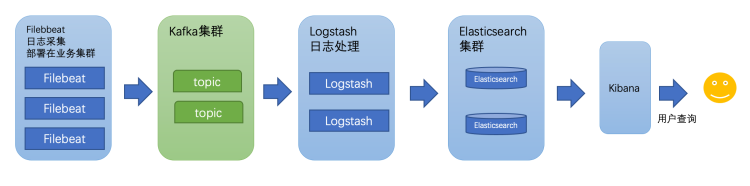
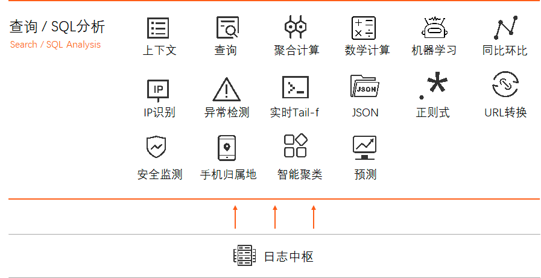
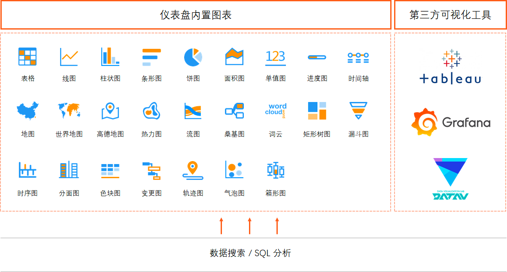
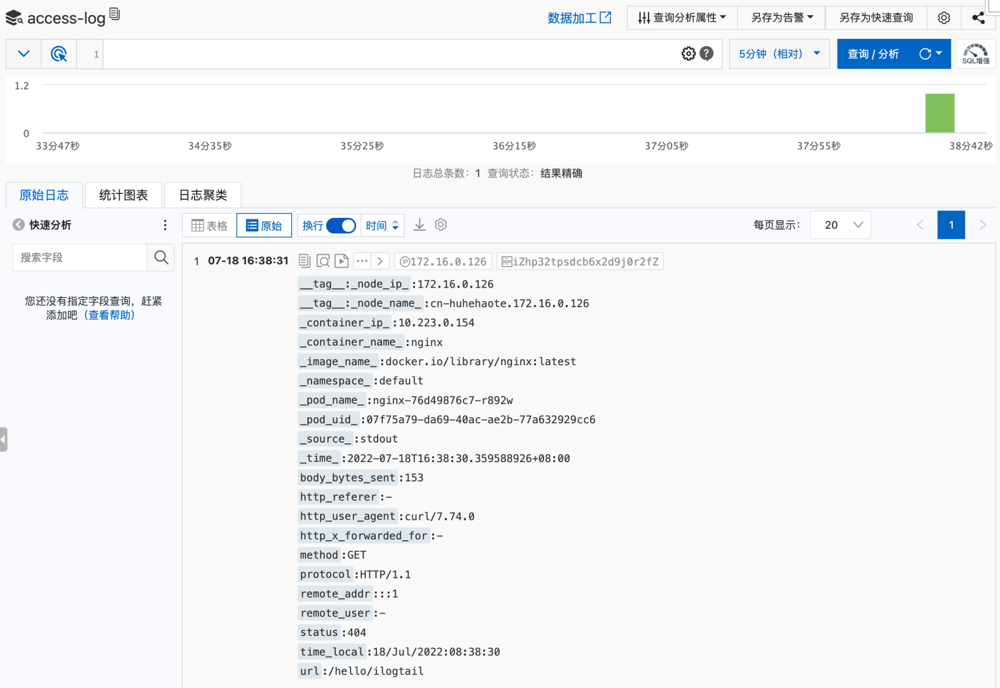

# Collect business logs to SLS in K8s environment

'iLogtail' is a observable data collection 'Agent' developed by the Alibaba Cloud log service (SLS) team. It has many production-level features such as lightweight, high-performance, and automated configuration. It can be used to collect telemetry data in various environments such as physical machines, virtual machines, and 'Kubernetes.iLogtail has served the observability collection of tens of thousands of customer hosts and containers on Alibaba Cloud. Its core product lines, such as Taobao, Tmall, Alipay, Cainiao, and AMAP, are also default tools for collecting various observable data such as logs, monitoring, and Trace. Currently, iLogtail has tens of millions of installation capacity,Dozens of PB of observable data are collected every day, which are widely used in various scenarios such as online monitoring, problem analysis/positioning, Operation analysis, and security analysis, and have verified its strong performance and stability in actual combat. In today's cloud-native era, we firmly believe that open source is the best development strategy for iLogtail,It is also a way to release its maximum value. Therefore, we decided to open the 'iLogtail' source, hoping to work with many developers to build iLogtail into a world-class observable data collector.

## Background

As an important part of observability construction, logs can record detailed access requests and error messages, and often play an important role in business analysis and problem location. In general development scenarios, when log analysis is required, grep is often used to search for the corresponding keywords in the log file;However, in a large-scale distributed production environment, this method is inefficient. The common solution is to establish a centralized log collection system to collect, manage, and analyze logs on all nodes. Currently, the mainstream open source solution in the market is to build a log collection and analysis system based on ELK.



In this architecture, 'Filebeat' is deployed on the business cluster to collect raw logs, and the collected logs are sent to the message queue 'Kafka' cluster. After that, 'Logstash' consumes data from 'Kafka', and after filtering and processing,Write standardized logs to the 'Elasticsearch' cluster for storage. Finally, 'Kibana' is presented to the user for query. Although this architecture can provide complete log collection and analysis functions, it involves many components and has high deployment complexity in large-scale production environments,In addition, ES may be unstable under high traffic, resulting in high O & M costs.

The SLS service provided by Alibaba Cloud is a cloud-based hosting service that is exclusively positioned in the log/time series observable data analysis Scenario. Compared with ELK, it has made many Customized developments in the log field, and has good performance in ease of use, functional completeness, performance, and cost. 'iLogtail' is an official standard observable data collector for SLS,In [log collection performance](https://github.com/alibaba/ilogtail/blob/main/docs/zh/performance/Performance-compare-with-filebeat.md) and [K8s](https://developer.aliyun.com/article/806369) support have good experience; 'iLogtail' has obvious performance advantages, which can lead some data processing to reduce storage costs effectively.


Currently, **Community Edition** 'iLogtail' also provides good support for SLS. This article will introduce in detail how to use **Community Edition** 'iLogtail' and quickly build a high-availability and high-performance log collection and analysis system in combination with SLS cloud services.

Note: 'iLogtail' **Community Edition** compared with 'iLogtail' Enterprise edition, the core collection capabilities are basically the same, but the control and observability capabilities are weakened. These capabilities can only be developed with the SLS server. Welcome to [iLogtail Enterprise Edition](https://help.aliyun.com/document\_detail/95923.html) experience. For more information about the differences between the two versions, see [link](https://ilogtail.gitbook.io/ilogtail-docs/about/compare-editions).

## SLS overview

Log service (SLS) is a cloud-native observation and analysis platform that provides large-scale, low-cost, and real-time platform services for Log, Metric, and Trace data. Log service provides features such as data collection, processing, query and analysis, visualization, alerting, consumption, and delivery, to improve your digitization capabilities in R & D, O & M, operations, and security scenarios.SLS allows you to quickly build your own observable analysis platform and quickly enjoy various data services provided by SLS, including query and analysis, visualization, and alerts.

* Query and analysis
* Supports exact query, fuzzy query, full-text query, and Field query.
* Use SQL as the query and analysis framework, and integrate PromQL syntax and machine learning functions into the framework.



* Visualization
* Based on the unified query and analysis engine of SLS, the query and analysis results are presented in the form of charts to clearly present the global situation.
* Supports docking with third-party visualization tools.



* Monitoring and alerting: an intelligent O & M platform that provides one-stop alarm monitoring, noise reduction, transaction management, and notification distribution.


## Actual operation

The following describes how to use the 'iLogtail' Community Edition to collect business logs from the K8s environment to SLS.

### Scenario <a href = "#reuza" id = "reuza"></a>

Select the container with the Label 'app: nginx', collect the standard output stream 'stdout' (access logs) and the standard error stream 'stderr' (error logs), and write the collected logs to SLS. Collect 'json.log' text logs and write them to SLS.

'stdout' uses regular parsing to parse logs into structured logs; 'stdin' is a single-line text print; And 'json.log' is a JSON file.

If you have used 'iLogtail' to collect logs to 'Kafka', you can keep double write during the migration phase. After the migration is stable, you can delete the 'Kafka fleful' configuration.


### Prerequisites

* Log on to the Alibaba Cloud SLS console and [activate the SLS service](https://help.aliyun.com/document\_detail/54604.html#section-j4p-xt3-arc).
* A Project has been created. The two logstore are access-log and error-log. For more information, see [create Project](https://help.aliyun.com/document\_detail/48984.htm#section-ahq-ggx-ndb) and [create Logstore](https://help.aliyun.com/document\_detail/48990.htm#section-v52-2jx-ndb).


* Enable [full-text indexing](https://help.aliyun.com/document\_detail/90732.html).
* Go to the home page of the Project to view the [domain name](https://help.aliyun.com/document\_detail/29008.html?spm=5176.2020520112.help.dexternal.5d8b34c0QXLYgp).


* nginx is deployed in the K8s environment.

```yaml  {.line-numbers}
apiVersion: apps/v1
kind: Deployment
metadata:
  name: nginx
  namespace: default
  labels:
    app: nginx
spec:
  replicas: 1
  selector:
    matchLabels:
      app: nginx
  template:
    metadata:
      labels:
        app: nginx
    spec:
      containers:
        - image: 'nginx:latest'
          name: nginx
          ports:
            - containerPort: 80
              name: http
              protocol: TCP
          resources:
            requests:
              cpu: 100m
              memory: 100Mi
```

* A program for printing json log files has been deployed in the K8s environment.

```yaml {.line-numbers}
apiVersion: apps/v1
kind: Deployment
metadata:
  labels:
    app: json-log
  name: json-log
  namespace: default
spec:
  replicas: 1
  selector:
    matchLabels:
      app: json-log
  template:
    metadata:
      labels:
        app: json-log
    spec:
      containers:
        - args:
            - >-
              mkdir -p /root/log; while true; do date +'{"time":"+%Y-%m-%d
              %H:%M:%S","message":"Hello, iLogtail!"}' >>/root/log/json.log;
              sleep 10; done
          command:
            - /bin/sh
            - '-c'
            - '--'
          image: 'alpine:3.9.6'
          name: json-log
          volumeMounts:
            - mountPath: /etc/localtime
              name: volume-localtime
      volumes:
        - hostPath:
            path: /etc/localtime
            type: ''
          name: volume-localtime
```

### Deploy iLogtail <a href = "#vmyyq" id = "vmyyq"></a>

The configurations used in this topic can be found in [GitHub](https://github.com/alibaba/ilogtail/blob/main/k8S\_templates/ilogtail-daemonset-sls.yaml) download, container standard output plug-in detailed configuration can be moved to [iLogtail User Manual](https://ilogtail.gitbook.io/ilogtail-docs/plugins/input/input-docker-stdout).

* Create a namespace

Recommend deploy iLogtail in an independent named Space Station for management.

ilogtail-ns.yaml

```yaml
apiVersion: v1
kind: Namespace
metadata:
  name: ilogtail
```

```bash
kubectl apply -f ilogtail-ns.yaml
```

* Create a collection configuration

ilogtail-user-configmap.yaml

```yaml {.line-numbers}
apiVersion: v1
kind: ConfigMap
metadata:
  name: ilogtail-user-cm
  namespace: ilogtail
data:
  nginx_stdout.yaml: |
    enable: true
    inputs:
      - Type: service_docker_stdout
        Stderr: false
        Stdout: true
        IncludeK8sLabel:
          app: nginx
    processors:
      - Type: processor_regex
        SourceKey: content
        Regex: '([\d\.:]+) - (\S+) \[(\S+) \S+\] \"(\S+) (\S+) ([^\\"]+)\" (\d+) (\d+) \"([^\\"]*)\" \"([^\\"]*)\" \"([^\\"]*)\"'
        Keys:
          - remote_addr
          - remote_user
          - time_local
          - method
          - url
          - protocol
          - status
          - body_bytes_sent
          - http_referer
          - http_user_agent
          - http_x_forwarded_for
    flushers:
      - Type: flusher_sls
        Region: cn-hangzhou
        Endpoint: cn-hangzhou.log.aliyuncs.com
        Project: test-ilogtail
        Logstore: access-log
      - Type: flusher_kafka
        Brokers:
          - localhost:9092
        Topic: access-log
  nginx_stderr.yaml: |
    enable: true
    inputs:
      - Type: service_docker_stdout
        Stderr: true
        Stdout: false
        K8sNamespaceRegex: "^(default)$"
        K8sPodRegex: "^(nginx-.*)$"
        K8sContainerRegex: "nginx"
    flushers:
      - Type: flusher_sls
        Region: cn-hangzhou
        Endpoint: cn-hangzhou.log.aliyuncs.com
        Project: test-ilogtail
        Logstore: error-log
      - Type: flusher_kafka
        Brokers:
          - localhost:9092
        Topic: error-log
  json_log.yaml: |
    enable: true
    inputs:
      - Type: input_file
        FilePaths: 
          - /root/log/json.log
        EnableContainerDiscovery: true
        ContainerFilters:
          IncludeContainerLabel:
            io.kubernetes.container.name: json-log
    processors:
      - Type: processor_json
        SourceKey: content
        KeepSource: false
        ExpandDepth: 1
        ExpandConnector: ""
    flushers:
      - Type: flusher_sls
        Region: cn-hangzhou
        Endpoint: cn-hangzhou.log.aliyuncs.com
        Project: test-ilogtail
        Logstore: json-log
      - Type: flusher_kafka
        Brokers:
          - localhost:9092
        Topic: json-log
```

Change rows 33-35, 51-53, and 75-77 in the template to the target SLS project, and rows 38, 56, and 80 to the actual Kafka broker address.

```bash
kubectl apply -f ilogtail-user-configmap.yaml
```

The ConfigMap here is expected to be mounted to the iLogtail container as a collection configuration directory, so it can contain multiple iLogtail collection configuration files. The 7th to 39th acts as one collection configuration and the 40th to 57th acts as another collection configuration. The standard output stream and standard error stream of nginx are collected to different 'logstore' and 'Kafka' different 'Topic' respectively.Dual-write is applicable to scenarios where you migrate data from 'Kafka' to SLS. If the migration is stable, you can delete `flusher_kafka` and only keep `flusher_sls`.

Lines 13-14 and 46-48 show how to filter containers for log collection. The former uses Kubernetes Label as the filter condition, while the latter uses Namespace, Pod, and Container names for filtering. For all supported configuration items, see [Container stdout](https://ilogtail.gitbook.io/ilogtail-docs/plugins/input/input-docker-stdout).

Lines 16-30 show how to use the plug-in to perform regular parsing on logs. For more information about the configuration items, see [regex](https://ilogtail.gitbook.io/ilogtail-docs/plugins/processor/regex) in the iLogtail user manual.

* Obtain the Alibaba Cloud AK and create a key.

ilogtail-secret.yaml

```yaml {.line-numbers}
apiVersion: v1
kind: Secret
metadata:
  name: ilogtail-secret
  namespace: ilogtail
type: Opaque
data:
  access_key_id: <base64_access_key_id>
  access_key: <base64_access_key_secret>
```

Obtain the Alibaba Cloud AK and perform Base64.

```bash
echo -n '<aliyun_access_key_secret>' | base64
echo -n '<aliyun_access_key_id>' | base64
```

Modify 8-9 lines in the template.

```bash
kubectl apply -f ilogtail-secret.yaml
```

* 部署iLogtail DaemonSet

ilogtail-deployment.yaml

```yaml {.line-numbers}
apiVersion: apps/v1
kind: DaemonSet
metadata:
  name: ilogtail-ds
  namespace: ilogtail
  labels:
    k8s-app: logtail-ds
spec:
  selector:
    matchLabels:
      k8s-app: logtail-ds
  template:
    metadata:
      labels:
        k8s-app: logtail-ds
    spec:
      tolerations:
      - key: node-role.kubernetes.io/master
        effect: NoSchedule
      containers:
      - name: logtail
        env:
          - name: ALIYUN_LOG_ENV_TAGS # add log tags from env
            value: _node_name_|_node_ip_
          - name: _node_name_
            valueFrom:
              fieldRef:
                apiVersion: v1
                fieldPath: spec.nodeName
          - name: _node_ip_
            valueFrom:
              fieldRef:
                apiVersion: v1
                fieldPath: status.hostIP
          - name: cpu_usage_limit
            value: "1"
          - name: mem_usage_limit
            value: "512"
          - name: default_access_key_id
            valueFrom:
              secretKeyRef:
                name: ilogtail-secret
                key: access_key_id
                optional: true
          - name: default_access_key
            valueFrom:
              secretKeyRef:
                name: ilogtail-secret
                key: access_key
                optional: true
        image: >-
          sls-opensource-registry.cn-shanghai.cr.aliyuncs.com/ilogtail-community-edition/ilogtail:latest
        imagePullPolicy: IfNotPresent
        resources:
          limits:
            cpu: 1000m
            memory: 1Gi
          requests:
            cpu: 400m
            memory: 384Mi
        volumeMounts:
          - mountPath: /var/run
            name: run
          - mountPath: /logtail_host
            mountPropagation: HostToContainer
            name: root
            readOnly: true
          - mountPath: /usr/local/ilogtail/checkpoint
            name: checkpoint
          - mountPath: /usr/local/ilogtail/config/local
            name: user-config
            readOnly: true
      dnsPolicy: ClusterFirstWithHostNet
      hostNetwork: true
      volumes:
        - hostPath:
            path: /var/run
            type: Directory
          name: run
        - hostPath:
            path: /
            type: Directory
          name: root
        - hostPath:
            path: /var/lib/ilogtail-ilogtail-ds/checkpoint
            type: DirectoryOrCreate
          name: checkpoint
        - configMap:
            defaultMode: 420
            name: ilogtail-user-cm
          name: user-config
```

```bash
kubectl apply -f ilogtail-deployment.yaml
```

The 17-19 lines of the configuration file define the tolerance of the deployment node: it is not deployed on the master node.

Rows 23-34 additionally collect the ip address and name of the node where the iLogtail container is located through environment variables (these two values must be the same for the business container and iLogtail).

The iLogtail is configured in rows 35-38 by using the container environment variables. The cpu and memory limits are configured here. For complete system configuration instructions, please refer to [system parameters](https://ilogtail.gitbook.io/ilogtail-docs/configuration/system-config)。

Rows 43-48 define the range of resources allowed by the collection Agent container. If you need to collect a large number of log files, you need to relax the resource limits.

Rows 39-50 reference the AK in secret as the environment variable, which is necessary to write logs to SLS.

Some directories are mounted on lines 62-72 of the configuration file, as follows:

`/var/run`: the socket used by the iLogtail to communicate with the container runtime.

`/Logtail_host`: iLogtail obtain the logs of all containers on the node by mounting the host directory.

`/usr/local/ilogtail/checkpoint`: The status is persisted to the host disk iLogtail the container is restarted.

`/usr/local/ilogtail/config/local`: Mount the configuration in the configmap to the container

### Verify <a href = "#fr6wn" id = "fr6wn"></a>

* Access log verification to check logstore data is normal.

Send nginx several test requests, such:

```bash
# Write access logs
kubectl exec nginx-76d49876c7-r892w -- curl localhost/hello/ilogtail
```

Query results in the SLS console



* Verify the error log to check logstore the data is normal.

Query results in the SLS console


* Verify JSON logs to check logstore data is normal.

Query results in the SLS console


## Summary <a href = "#ovoc3" id = "ovoc3"></a>

Above, we introduced how to use iLogtail Community Edition to collect K8s business logs to SLS. If you want to experience more in-depth integration between Enterprise Edition iLogtail and SLS, you are welcome to use iLogtail Enterprise Edition and build an observable platform with SLS.

## About iLogtail

As an observable data collector provided by Alibaba Cloud SLS, iLogtail can run in various environments such as servers, containers, K8s, and embedded systems. It can collect hundreds of observable data (such as logs, monitoring, Trace, and events) and has tens of millions of installations. Currently, iLogtail has been officially open-source,Welcome to use and participate in co-construction.

* GitHub：[https://github.com/alibaba/ilogtail](https://github.com/alibaba/ilogtail)
* Community edition document: [https://ilogtail.gitbook.io/ilogtail-docs/about/readme](https://ilogtail.gitbook.io/ilogtail-docs/about/readme)
* Scan the Communication Group


