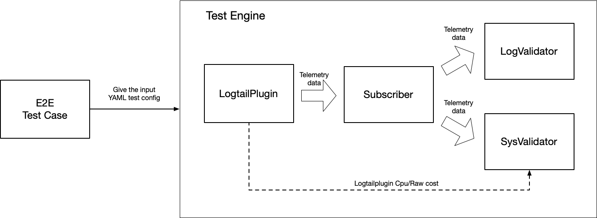

# ILogtail Test Engine

Test Engine is an assist tool for conducting end-to-end tests for ILogtail, including behavioral testing and performance
testing. It uses YAML to define the test behavior, which means test codes are not necessary for most conditions. If the
test scenario is not met, the pluggable structure is provided to extend. Currently, there are two kinds of plugins
provided, namely [validator](docs/How-to-write-test-engine-plugin.md)
and [subscriber](docs/How-to-write-test-engine-plugin.md).

# DataFlow

When the test case config is loaded, Test Engine would start a virtual environment to do the test case. ILogtail
container would transfer the telemetry data to the selected Subscriber. LogValidator and SysValidator would valid the
received telemetry data according to the given configuration, such as valid log fields, check metrics labels and check
log num. In addition, SysValidator also read the ILogtail CPU and memory cost to do performance check.


# Contribution

If you want to add custom plugins for Test Engine, please read the [doc](./docs/How-to-write-test-engine-plugin.md).

# Config Test Case

## Define the test process

The following configuration is to test nginx plugin behavior, the case would help you to learn how to config a test
case.

- boot: [**Required**]
    - category: the virtual environment category, currently only support `docker-compose`.
    - timeout: the timeout period of virtual environment, the default value is `60s`.
- ilogtail: [**Required**]
    - config: the ILogtail configuration array, the including items would be loaded to ILogtail container before
      testing.
        - name: the config name.
        - content: the ILogtail configuration array.
    - close_wait: the wait period before closing the test case to transfer the data on the way.
    - env: the env in ILogtail container.
    - depend_on: control the sequence of starting ILogtail container, which is same as docker-compose.
- subscriber: [**Optional**] the default subscriber is `gRPC subscriber`. More details please
  see [here](./docs/plugin-list.md).
    - name: the subscriber category.
    - config: the subscriber configuration map.
- trigger: [**Optional**]
    - url: the HTTP request URL.
    - method: the request method.
    - interval: the interval between 2 requests.
    - times: the trigger times.
- verify: [**Required**]
    - log_rules: the LogValidator configuration array. More details please see [here](./docs/plugin-list.md).
    - system_rules: the SysValidator configuration array. More details please see [here](./docs/plugin-list.md).
- retry: [**Optional**] the retry times when facing test failed.
    - times: the retry times, the default value is `1`.
    - interval: the retry interval, the default value is `10s`.
- test_interval: [**Required**] the total test interval.

```yaml
boot:
  category: docker-compose
ilogtail:
  config:
    - name: nginx-case
      content:
        - '{"inputs":[{"type":"metric_nginx_status","detail":{"IntervalMs":1000,"Urls":["http://nginx/nginx_status"]}}]}'
  close_wait: 5s
  depends_on:
    nginx:
      condition: service_healthy
trigger:
  url: http://nginx/hello
  method: GET
  interval: 1s
  times: 10
verify:
  log_rules:
    - name: fields-check
      validator: log_fields
      spec:
        expect_log_fields:
          - _server_
          - _port_
          - accepts
          - handled
          - requests
          - reading
          - writing
          - waiting
          - active
  system_rules:
    - name: counter-check
      validator: sys_counter
      spec:
        expect_equal_raw_log: true
        expect_equal_processed_log: true
        expect_equal_flush_log: true
        expect_received_minimum_log_num: 10
testing_interval: 15s
```

## Define dependency environment

If you only depends on the ILogtail container, please skip the part.

### Docker-Compose Environment

Only need to define a `docker-compose.yaml` without any ILogtail configuration.

```yaml
version: '3.8'

services:
  nginx:
    image: nginx:stable-alpine
    hostname: nginx
    volumes:
      - ./nginx_default.conf:/etc/nginx/conf.d/default.conf
    ports:
      - "80"
    healthcheck:
      test: [ "CMD-SHELL", "curl -O /dev/null http://localhost || exit 1" ]
      timeout: 5s
      interval: 10s
      retries: 3
```

## Try to run nginx test demo

In the root dir，the test reports are contained in `beaverhor-test/report` dir after executing the following commands.
`TEST_SCOPE=input_nginx  TEST_DEBUG=true   make e2e `